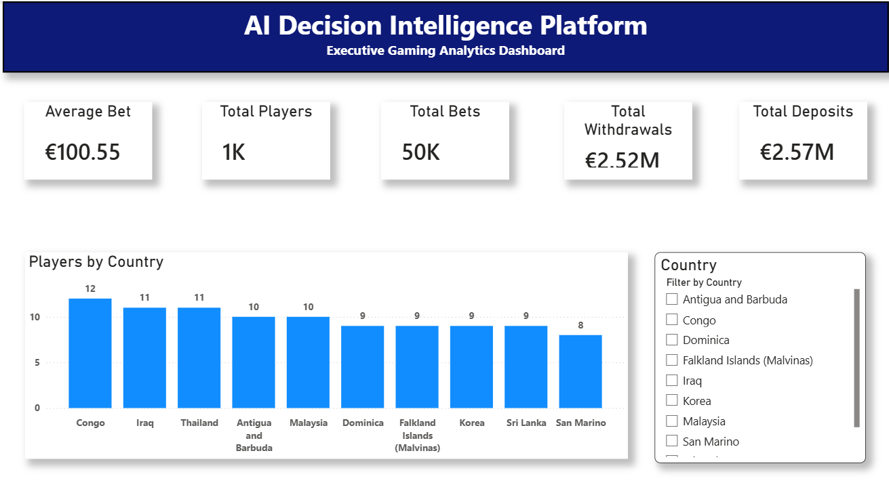
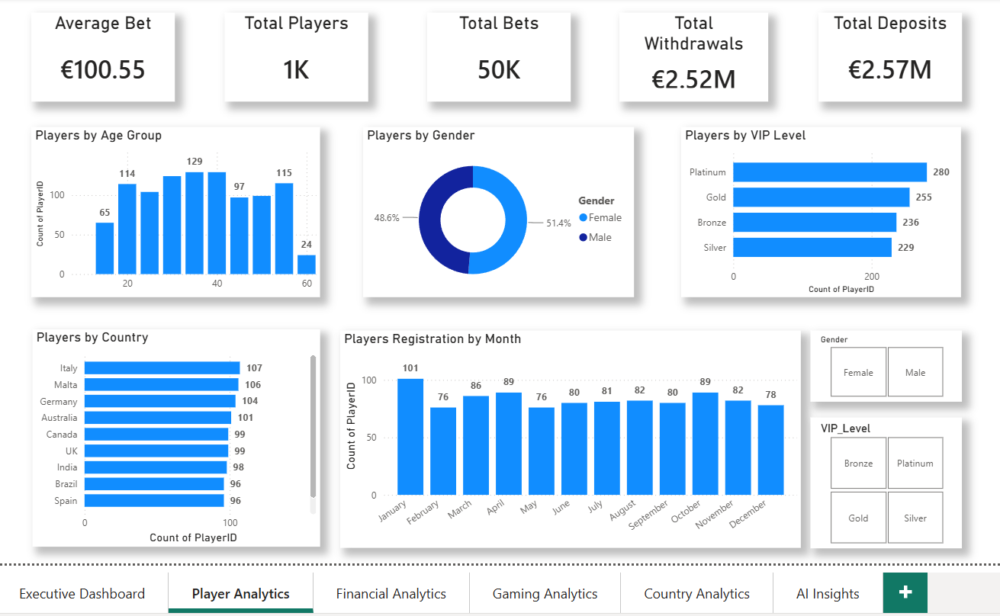
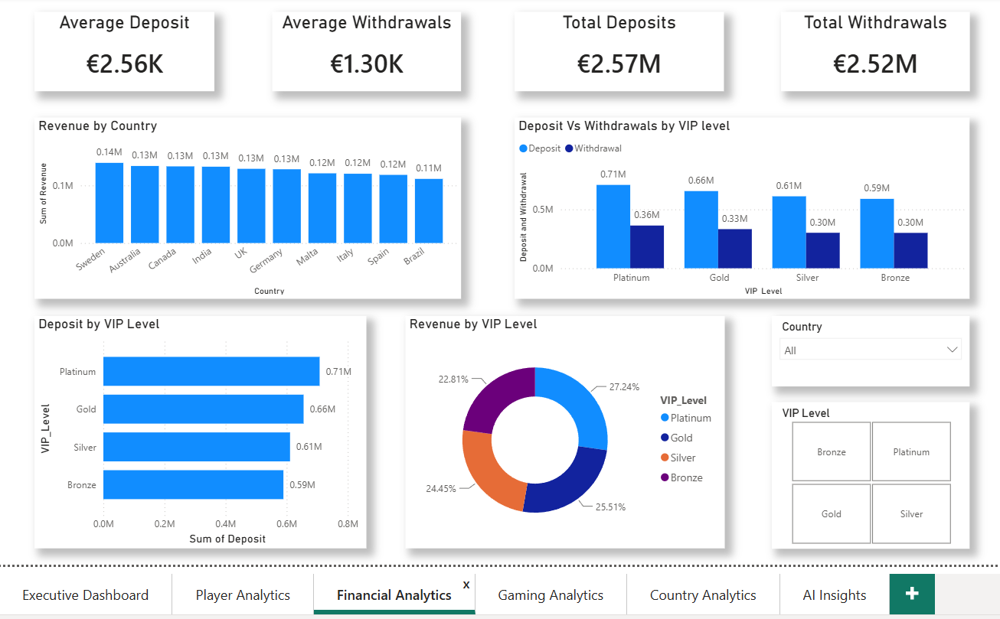
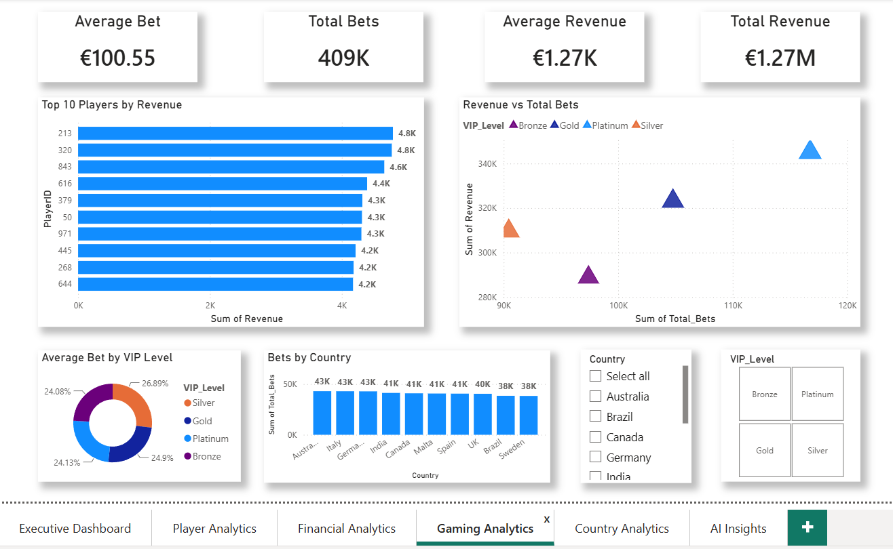
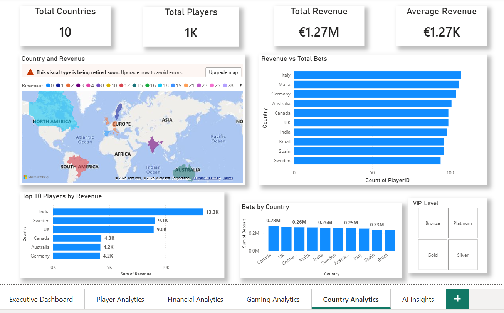
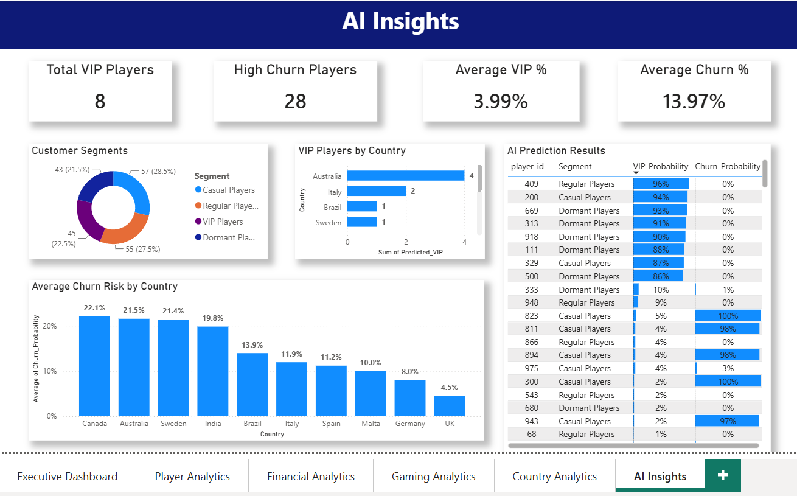

# 🎮 AI Decision Intelligence Platform for iGaming

An end-to-end analytics platform built to help iGaming companies monitor player behaviour, identify VIP customers, predict churn, and support data-driven business decisions using SQL, Python, Machine Learning, and Power BI.

---

## 📌 Project Overview

The AI Decision Intelligence Platform is a complete analytics solution that combines data engineering, SQL analytics, machine learning, and interactive dashboards into a single business intelligence platform.

The project simulates a real-world iGaming environment where thousands of player transactions are processed, analysed, and transformed into actionable business insights.

Key capabilities include:

- Interactive executive dashboards
- Advanced SQL analytics
- Customer segmentation using Machine Learning
- VIP player prediction
- Churn prediction
- Financial and gaming analytics
- Country-level performance monitoring

---

## 🎯 Business Problem

iGaming companies generate millions of betting transactions every day.

Business teams need quick answers to questions such as:

- Which players are likely to churn?
- Who are the next potential VIP customers?
- Which countries generate the highest revenue?
- What games perform best?
- Which customers require retention campaigns?

Traditional reporting answers what happened.

This platform answers **what happened, why it happened, and what is likely to happen next.**

---

## 🏗️ System Architecture

The platform follows a modern analytics pipeline where raw data flows through multiple processing layers before reaching business users.

```text
Raw CSV Data
      │
      ▼
SQLite Database
      │
      ▼
SQL Analytics Layer
      │
      ├──────────────┐
      ▼              ▼
Machine Learning   Business KPIs
      │              │
      └──────┬───────┘
             ▼
     Power BI Dashboard
             │
             ▼
 Executive Decision Making (Decision Intelligence)
```

The platform is divided into five major components:

- **Data Layer** – Stores raw player, betting, and transaction data.
- **Database Layer** – SQLite database with optimized tables, views, and SQL queries.
- **Analytics Layer** – Business SQL queries for revenue, player activity, country insights, and financial KPIs.
- **Machine Learning Layer** – Customer segmentation, VIP prediction, and churn prediction models.
- **Visualization Layer** – Interactive Power BI dashboards for business users.

---

## 🛠️ Technology Stack

| Category | Technology |
|----------|------------|
| Programming | Python |
| Database | SQLite |
| SQL | SQLite SQL |
| Machine Learning | Scikit-learn |
| Data Processing | Pandas, NumPy |
| Data Visualization | Power BI |
| Version Control | Git & GitHub |
| Documentation | Markdown |

---


## 🚀 Project Highlights

✔ Generated a realistic iGaming dataset containing players, bets, and financial transactions.

✔ Designed and implemented a relational SQLite database.

✔ Developed advanced SQL views and analytical business queries.

✔ Built six interactive Power BI dashboard pages.

✔ Engineered features for predictive analytics.

✔ Built Machine Learning models for:
- Customer Segmentation
- VIP Prediction
- Churn Prediction

✔ Combined AI predictions into a unified Power BI dashboard.

✔ Structured the project using industry-standard software engineering practices.

---

## 📂 Repository Structure

```text
AI-Decision-Intelligence-Platform-Lite
│
├── dashboards/
│   └── AI_Decision_Intelligence_Platform.pbix
│
├── data/
│   ├── raw/
│   ├── processed/
│   └── sample/
│
├── database/
│   ├── schema/
│   ├── sql/
│   └── igaming_platform.db
│
├── docs/
│   ├── architecture/
│   ├── business-overview/
│   ├── requirements/
│   └── project-journal/
│
├── ml/
│   ├── data/
│   ├── models/
│   ├── outputs/
│   └── src/
│
├── screenshots/
│
├── src/
│   ├── data_generation/
│   └── database/
│
├── README.md
└── requirements.txt
```

---

## ✨ Features

### 📊 Business Intelligence

- Executive KPI Dashboard
- Financial Analytics
- Gaming Analytics
- Country Performance Analysis
- Player Analytics

### 🗄 Database

- Relational SQLite Database
- SQL Views
- Advanced Business Queries
- Performance Optimization

### 🤖 Artificial Intelligence

- Customer Segmentation (K-Means)
- VIP Player Prediction (Random Forest)
- Churn Prediction (Random Forest)

### 📈 Interactive Reporting

- Six Power BI Dashboard Pages
- AI Prediction Dashboard
- Country-Level Insights
- Financial KPIs
- Executive Dashboard

---

## 📊 Dashboard Pages

The Power BI report contains six interactive dashboards:

| Dashboard | Description |
|-----------|-------------|
| Executive Dashboard | High-level business KPIs and overall platform performance |
| Player Analytics | Player behaviour, activity, and engagement analysis |
| Financial Analytics | Revenue, deposits, withdrawals, and profitability insights |
| Gaming Analytics | Game popularity, betting trends, and payouts |
| Country Analytics | Regional player distribution and revenue comparison |
| AI Insights | Customer Segmentation, VIP Prediction, and Churn Prediction |

---

## 📸 Dashboard Preview

The platform contains six interactive Power BI dashboard pages designed for different business stakeholders.

### 1. Executive Dashboard



---

### 2. Player Analytics



---

### 3. Financial Analytics




---

### 4. Gaming Analytics


---

### 5. Country Analytics



---

### 6. AI Insights


---

## 🤖 Machine Learning Pipeline

Three machine learning models were developed to generate predictive business insights.

### Customer Segmentation

- Algorithm: K-Means Clustering
- Objective: Group players based on betting behaviour and activity.
- Output:
  - Casual Players
  - Regular Players
  - VIP Players
  - Dormant Players

---

### VIP Prediction

- Algorithm: Random Forest Classifier
- Objective: Predict high-value players likely to become VIP customers.
- Output:
  - VIP Prediction
  - VIP Probability Score

---

### Churn Prediction

- Algorithm: Random Forest Classifier
- Objective: Predict players at risk of becoming inactive.
- Output:
  - Churn Prediction
  - Churn Probability Score

---

The machine learning outputs are exported as CSV files and integrated into Power BI for interactive visualization.

---

## 📈 Business Impact

The platform enables business stakeholders to:

- Identify high-value VIP customers.
- Detect players at risk of churn.
- Monitor country-level performance.
- Analyze betting behaviour and financial trends.
- Support data-driven marketing and retention strategies.
- Improve executive decision-making through interactive dashboards.

---

## ⚙️ Installation

### Clone the Repository

```bash
git clone https://github.com/<your-github-username>/AI-Decision-Intelligence-Platform-Lite.git
```

### Navigate to the Project

```bash
cd AI-Decision-Intelligence-Platform-Lite
```

### Create Virtual Environment

```bash
python -m venv .venv
```

### Activate Environment

**Windows**

```bash
.venv\Scripts\activate
```

**Mac/Linux**

```bash
source .venv/bin/activate
```

### Install Dependencies

```bash
pip install -r requirements.txt
```

---

## ▶️ Running the Project

### Generate Sample Data

```bash
python src/data_generation/generate_data.py
```

### Create SQLite Database

```bash
python src/database/load_database.py
```

### Run Machine Learning Models

Customer Segmentation

```bash
python ml/src/customer_segmentation.py
```

VIP Prediction

```bash
python ml/src/vip_prediction.py
```

Churn Prediction

```bash
python ml/src/churn_prediction.py
```

Combine AI Predictions

```bash
python ml/src/combine_predictions.py
```

### Open Dashboard

Open the Power BI file located in:

```text
dashboards/AI_Decision_Intelligence_Platform.pbix
```

---

## 🔮 Future Enhancements

Possible future improvements include:

- PostgreSQL or SQL Server integration
- Azure or AWS cloud deployment
- Real-time streaming dashboards
- Automated data refresh pipelines
- REST API integration
- Advanced machine learning models
- Model monitoring and retraining
- Role-based dashboard security
- Interactive forecasting dashboards

---

## 📚 Skills Demonstrated

- SQL Database Design
- Data Modeling
- Python Programming
- Machine Learning
- Feature Engineering
- Data Visualization
- Power BI
- Git & GitHub
- Business Intelligence
- Analytics Storytelling
- End-to-End Project Development

---

## 👩‍💻 Author

**Kirthana**

This project was developed as part of a professional analytics portfolio to demonstrate end-to-end skills in data engineering, business intelligence, machine learning, and decision intelligence.

Feel free to connect with me on LinkedIn and explore the repository.

---
